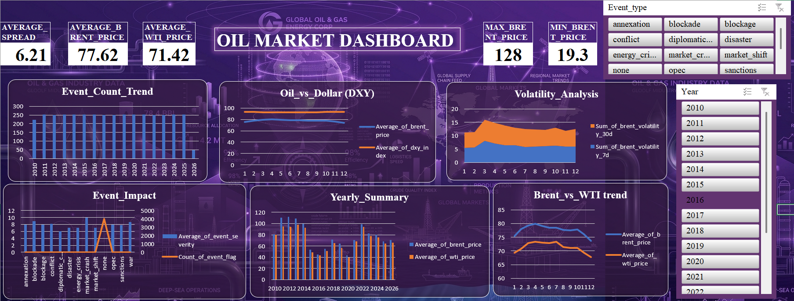

<h1 align="center"> Oil Market Dashboard (Excel)</h1>

  <b>Microsoft Excel | Data Analysis | Energy Market Insights</b>

<h2> Overview</h2>

This project presents an interactive <b>Oil Market Dashboard</b> built using <b>Microsoft Excel</b>. 
It analyzes global oil price trends, market volatility, and the relationship between crude oil benchmarks such as Brent and WTI. 
The dashboard provides insights into how external factors influence energy markets over time.

<h2> Objective</h2>

To analyze historical oil market data and visualize trends in pricing, volatility, and external economic factors, 
enabling better understanding of market behavior and fluctuations.

<h2> Dashboard Preview</h2>

  

<h2> Key Metrics</h2>
<ul>
  <li>Average Brent Price</li>
  <li>Average WTI Price</li>
  <li>Average Spread (Brent - WTI)</li>
  <li>Maximum and Minimum Oil Prices</li>
</ul>

<h2> Analysis Performed</h2>
<ul>
  <li>Comparison of Brent vs WTI price trends</li>
  <li>Oil price movement against Dollar Index (DXY)</li>
  <li>Volatility analysis over time (7-day and 30-day)</li>
  <li>Event-based impact on oil prices</li>
  <li>Year-wise oil price summary</li>
</ul>

<h2> Tools & Techniques Used</h2>
<ul>
  <li><b>Microsoft Excel</b> – Dashboard creation</li>
  <li><b>Pivot Tables</b> – Data summarization</li>
  <li><b>Pivot Charts</b> – Data visualization</li>
  <li><b>Data Cleaning</b> – Preprocessing and structuring</li>
  <li><b>Formulas</b> – KPI calculations and metrics</li>
</ul>

<h2> Data Description</h2>

The dataset includes the following key fields:

<ul>
  <li>Date and Year</li>
  <li>Brent Oil Price</li>
  <li>WTI Oil Price</li>
  <li>Dollar Index (DXY)</li>
  <li>Volatility Measures</li>
  <li>Event Type (e.g., geopolitical, economic)</li>
</ul>

<h2> Key Insights</h2>
<ul>
  <li>Brent prices are generally higher than WTI, creating a consistent spread</li>
  <li>Oil prices show an inverse relationship with the Dollar Index (DXY)</li>
  <li>Market volatility increases during major global events</li>
  <li>Geopolitical events significantly impact oil price fluctuations</li>
</ul>

<h2> Dashboard Features</h2>
<ul>
  <li>Interactive filters (Year, Event Type)</li>
  <li>KPI cards for quick insights</li>
  <li>Trend and comparison charts</li>
  <li>Clean and visually appealing design</li>
</ul>

<h2> How to Use</h2>
<ol>
  <li>Download the Excel file from this repository</li>
  <li>Open it using <b>Microsoft Excel</b></li>
  <li>Use slicers and filters to explore different scenarios</li>
</ol>

<h2> Project Structure</h2>
<pre>
oil-market-dashboard-excel
│── oil_market_dashboard.xlsx
│── Images/
│   ├── oil_market_dashboard.png
│── README.md
</pre>

<i>Note: Dataset is included within the Excel file.</i>

<h2> Author</h2>

<b>Anjana C</b> 
Aspiring Data Analyst | Passionate about financial and market analysis

⭐ If you found this project useful, consider giving it a star!

